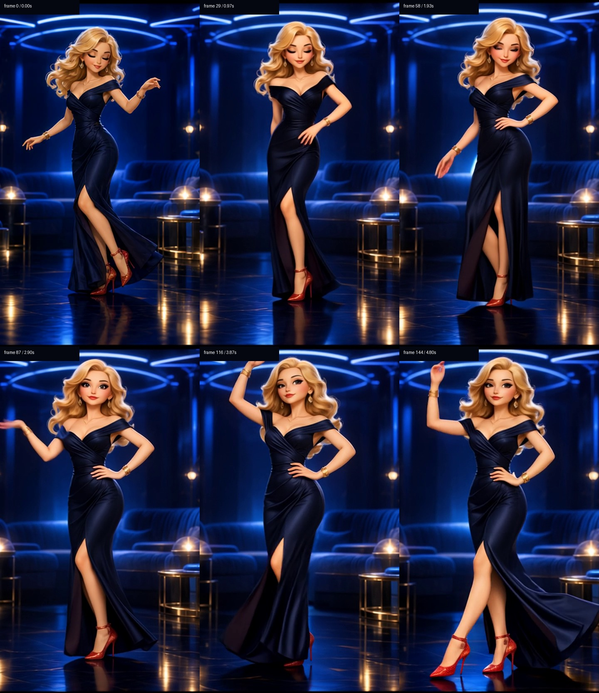

# Iteration 06 — first true-motion proof

Commit `d2f0129` replaces simulated image drift with a generated image-to-video
proof that starts from the original Neon Listening Lounge frame.

## Artifact

- File: `assets/videos/neon-listening-lounge-draft-30fps.mp4`
- Resolution: 480×832
- Frame rate: 30 fps
- Frames: 145
- Duration: 4.833 seconds
- SHA-256: `7282b4ebaaec6dc764b7f3940482589ee86f53b0f1b22d1f982c26e5f9f10f4c`
- Source: `assets/scenes/01-neon-listening-lounge.png`
- Seed: `41001`
- Sampling: 25 steps, TeaCache disabled

The machine-readable values are recorded in `assets/videos/manifest.json` and
are regenerated by the render wrapper after it decodes every output frame.

## Visual proof

Across the clip, Radiance changes arm and hand positions, shifts her hips and
weight between heels, changes leg placement, opens her eyes and changes gaze,
and moves her hair and dress. The lounge remains substantially anchored. These
are generated pose and garment changes rather than a CSS crop or zoom.

This is a draft proof, not the production master. The full configured scene is
rendered only after motion and identity review, then saved as
`neon-listening-lounge-full-30fps.mp4`.

## Efficient authoring proof

The authoring machine was already running VM workloads. The official bf16/fp16
models exceeded Windows' available commit limit, so the pipeline now provides a
reproducible low-RAM mode:

- the text model occupies 6.99GB in FP8 CPU storage;
- the transformer occupies 11.99GB in FP8 CPU storage;
- active text layers cast to fp16 on the GPU;
- active transformer layers cast to bf16;
- the final projection stays fp32 to preserve FramePack's high-quality output
  path;
- all 100 diffusion steps across four temporal sections completed on an RTX
  3080 Ti without shutting down the user's VMs.

The shipped app contains none of these model weights. It contains only the
pre-rendered MP4 masters, so playback is immediate and offline.

## Standalone proof

`npm run dist:preview` builds a portable Windows executable containing the
available generated clips and original-frame fallbacks. The packaged iteration
was launched with its screenshot argument and exited with code 0 after
capturing a frame labeled `GENERATED MOTION · 30 FPS`.

GitHub Actions builds and uploads this preview executable on every iteration.
The strict production artifact remains gated on all sixteen verified full masters.
