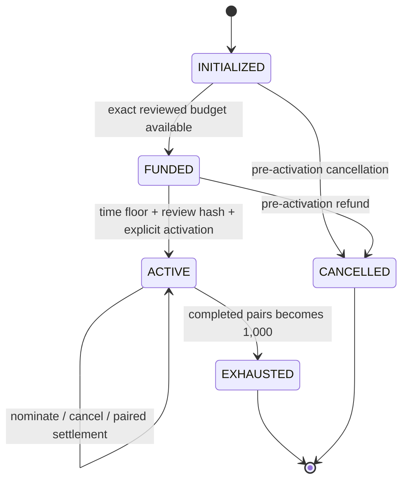
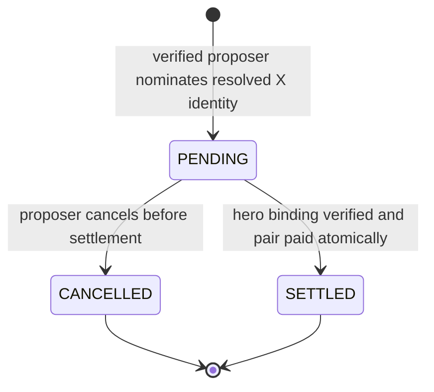

# Promotions DLC protocol and delivery plan

> **DRAFT / INACTIVE / NOT PART OF GENESIS / NOT DEPLOYED / NO CLAIM ROUTE**

Version: planning pass 0

Scope: a possible post-Genesis promotion only

Economic maximum: 1,000 paired settlements / 180,000 IAT

## 1. Product contract

A verified Internal Agency node may optionally nominate one hero by supplying
the hero's X handle. The nomination does not pay anyone and does not consume a
campaign slot. It becomes payable only when the nominated X identity is bound
to a verified Internal Agency node and a Solana wallet.

At that point one Solana transaction transfers 120 IAT to the hero and 60 IAT
to the proposer. The campaign records both role receipts and increments the
completed-pair counter in the same instruction. If any account, identity,
balance, or transfer check fails, no payment or counter change commits.

The campaign ends permanently after 1,000 completed pairs. The exact maximum
outflow is:

```text
hero rewards:      1,000 x 120 IAT = 120,000 IAT
proposer rewards:  1,000 x  60 IAT =  60,000 IAT
maximum total:                       180,000 IAT
```

With a 500,000,000 IAT community allocation, the maximum campaign budget is
0.036% of that allocation. This budget is separate from staking reserves,
treasury, ecosystem, liquidity, core-team principal, vesting, and CCC rewards.

## 2. Non-negotiable behavior

1. **Optional:** nomination is not an activation requirement.
2. **Post-Genesis only:** activation cannot occur before verified Genesis plus
   28,800 seconds.
3. **Separate activation:** time alone never activates the campaign. Review,
   full funding, and an explicit activation transaction are required.
4. **Paired settlement:** the hero and proposer transfers are one atomic unit.
5. **Independent connection:** the hero must acquire their own verified node
   binding; the proposer cannot create or control it.
6. **Immutable identity:** X numeric user identity controls uniqueness. A
   display handle may change without creating a new identity.
7. **Independent role limits:** one verified node may receive at most one hero
   reward and at most one proposer reward. Receiving one does not block the
   other.
8. **Triple deduplication:** node ID, wallet, and X identity commitment are
   checked independently for each reward role.
9. **No self-proposal:** matching node, wallet, or X identity on both sides is
   rejected.
10. **Hard cap:** exactly 1,000 completed pairs exhaust the campaign forever.
11. **No phantom capacity:** pending, rejected, duplicate, cancelled, or fake
    nominations do not increment the completed-pair counter.
12. **Public evidence:** aggregate state, vault balance, settlement sequence,
    public wallets, amounts, and transaction signatures are auditable.

## 3. Trust boundary

Solana cannot query X or prove that an X account belongs to a person. The
design therefore separates facts into two layers.

### Off-chain identity verifier

The verifier:

- completes X OAuth using the platform's registered application;
- reads the stable X numeric user ID rather than trusting a typed handle;
- resolves the nominated handle to that stable ID before accepting a
  nomination;
- verifies control of the bound Solana wallet through a domain-separated,
  expiring signature challenge;
- produces an attestation containing the campaign ID, node ID, wallet, opaque X
  identity commitment, purpose, expiry, and monotonic nonce; and
- appends every issued or revoked attestation to an independently auditable,
  append-only transparency log.

The verifier does **not** decide reward amounts, campaign capacity, or transfer
destinations after attestation. Those rules are enforced by the program.

### On-chain promotion program

The program:

- validates campaign timing and immutable configuration;
- validates verifier authority, nonce, purpose, and expiry;
- enforces proposal ownership and all uniqueness markers;
- holds only the dedicated promotion budget;
- transfers the fixed 120/60 amounts atomically;
- increments capacity only after both transfers succeed; and
- permanently transitions to `EXHAUSTED` at 1,000 completed pairs.

### Explicit limitation

One verified X account is one protocol identity, not proof of one human. The
system can reject duplicate X IDs, wallets, and nodes, but it cannot honestly
claim perfect Sybil resistance or real-world identity verification.

## 4. Identity representation and privacy

The typed `@handle` is display input only. The verifier resolves it to X's
stable numeric user ID. On-chain state stores an opaque 32-byte identity
commitment supplied by the verifier, not the handle, email, OAuth token, or raw
numeric ID.

Recommended version-zero commitment:

```text
HMAC-SHA256(campaign_identity_pepper, "iat-promo-x-v0" || x_numeric_user_id)
```

This avoids trivial public enumeration of numeric X IDs. It means identity
deduplication still trusts the verifier; that dependency must be disclosed. The
pepper belongs in a managed secret service, never source control or browser
storage. An independent auditor should receive a sealed copy or an auditable
derivation procedure so the verifier cannot silently rotate identity space
during the campaign.

Public UI may show a current X handle only with the user's consent and should
label it as mutable display data. The on-chain commitment remains the source of
uniqueness.

## 5. Proposed on-chain accounts

The implementation should be a standalone Promotions program. It must not add
promotion withdrawal paths or identity authority to the IAT V2 staking and
vesting program.

| Account | Suggested PDA seeds | Purpose |
| --- | --- | --- |
| `Campaign` | `promo`, campaign ID | Immutable mint, amounts, capacity, Genesis reference, activation floor, authorities, counters, status |
| `PromoVault` | token account owned by campaign PDA | Isolated 180,000 IAT maximum budget |
| `Nomination` | campaign, proposer node | One active nomination for a proposer |
| `HeroReservation` | campaign, hero X commitment | Prevents two active nominations for the same hero identity |
| `RoleMarker` | campaign, role, identity kind, identity value | Dedupe marker for node, wallet, and X commitment independently |
| `SettlementReceipt` | campaign, sequence | Amounts, parties, nomination, and settlement slot |

`RoleMarker.role` is either `HERO` or `PROPOSER`. A successful settlement
creates six markers: node, wallet, and X commitment for both roles. Marker
creation and both transfers happen in one transaction.

## 6. Campaign state machine



Rules:

- `INITIALIZED` and `FUNDED` have no claim path.
- Cancellation and refund exist only before `ACTIVE`.
- Once `ACTIVE`, operators cannot withdraw committed capacity or change amounts,
  mint, capacity, verifier, identity domain, Genesis reference, or activation
  floor.
- `EXHAUSTED` is irreversible and rejects every new nomination or settlement.
- Tokens sent accidentally to the vault after activation are not campaign
  capacity. After exhaustion, a permissionless finalizer may return only the
  balance above zero to the immutable community refund account.

## 7. Nomination state machine



Before creating `PENDING`, the instruction rejects:

- an unverified or expired proposer attestation;
- an unresolved X handle;
- a proposer who already received the proposer reward;
- an existing active nomination for the proposer;
- an existing hero reservation for the same X identity;
- any node, wallet, or X match between proposer and hero; and
- an inactive or exhausted campaign.

A proposer may cancel a pending nomination. Cancellation releases both the
proposer's active-nomination lock and the hero reservation without paying or
consuming capacity. If settlement and cancellation race, Solana ordering gives
one deterministic winner; the second transaction observes a terminal state and
fails without side effects.

No arbitrary expiry is imposed in version zero because the product promise says
the hero may connect later. Rate limiting and rent costs control state spam.

## 8. Settlement flow

1. Hero completes X OAuth and a wallet-signature challenge, or already has a
   current verified node binding.
2. Identity verifier derives the same hero X commitment stored by the
   nomination and issues a single-purpose, short-lived settlement attestation.
3. Relayer reads the campaign, vault, nomination, and all six prospective role
   markers from a confirmed RPC endpoint.
4. Relayer creates missing associated token accounts idempotently and submits
   `settle_pair`.
5. Program rechecks campaign state, commitment match, attestation nonce,
   destination wallets, self-proposal rules, role markers, remaining capacity,
   token mint, vault authority, and exact balance.
6. Program transfers 120 IAT to the hero and 60 IAT to the proposer through the
   canonical SPL Token Program.
7. Program creates all role markers and the settlement receipt, increments the
   counter, and emits `PairSettled`.
8. When the counter reaches 1,000, the same instruction writes `EXHAUSTED` and
   emits `CampaignExhausted`.

Any failed CPI, missing signature, duplicate marker, stale attestation, or
insufficient balance aborts the full Solana transaction.

## 9. Funding and accounting invariants

The policy assumes nine mint decimals. Amounts must be represented in base
units, never floating point:

| Value | IAT | Base units |
| --- | ---: | ---: |
| Hero reward | 120 | `120000000000` |
| Proposer reward | 60 | `60000000000` |
| Pair outflow | 180 | `180000000000` |
| Maximum campaign outflow | 180,000 | `180000000000000` |

Required invariants:

```text
completed_pairs <= 1,000
hero_receipts == proposer_receipts == completed_pairs
total_paid_base_units == completed_pairs * 180,000,000,000
hero_paid_base_units == completed_pairs * 120,000,000,000
proposer_paid_base_units == completed_pairs * 60,000,000,000
vault_outflow_base_units == total_paid_base_units
remaining_committed_base_units == (1,000 - completed_pairs) * 180,000,000,000
```

Activation requires at least the exact maximum campaign outflow in the vault.
The UI must distinguish vault balance from committed remaining capacity if an
external account transfers surplus tokens to the vault.

## 10. Genesis binding and activation gates

The standalone program should bind a specific IAT V2 configuration PDA and
verify its owner and seed derivation. It reads the recorded Genesis timestamp
and calculates:

```text
earliest_activation = verified_genesis_timestamp + 28,800 seconds
```

Before activation, all of the following must be public and pass:

- independently verified mainnet Genesis and IAT mint;
- source commit and reproducible program artifact hash;
- fixed campaign policy hash matching this public specification;
- standalone program ID and upgrade-authority policy;
- independent security review and resolved findings;
- Devnet rehearsal with duplicate, cancellation, replay, and exhaustion tests;
- community transfer funding exactly the dedicated campaign budget;
- promotion vault, refund account, identity verifier, and reviewer addresses;
- a mainnet simulation transcript with no broadcast authority; and
- an explicit activation transaction after the eight-hour time floor.

Eight hours is a **minimum**, not a launch promise. Missing review, funding, or
evidence keeps the campaign inactive indefinitely.

## 11. Upgrade policy recommendation

Campaign economics and identity domains must be immutable once active even if
the executable program remains upgradeable. Before mainnet, choose and publish
one of two honest security models:

1. revoke the standalone program's upgrade authority after audit; or
2. place upgrade authority behind a public, enforced timelock with the cold
   hardware administrator and an independent review key.

An ordinary single-key upgrade authority is not compatible with claims that the
active rules cannot change. The first implementation pass should model both
options; the deployment review must select exactly one.

## 12. Public API and UI contract

No route exists in this draft. A later UI should expose only these operations:

- `Nominate hero` for a verified proposer;
- `Cancel nomination` while it is pending;
- `Connect and verify` for a hero;
- read-only campaign status and evidence; and
- read-only personal proposer/hero eligibility and receipts.

Every action screen must show the actual connected wallet, network, exact
amounts, immutable X identity behavior, and whether the operation is off-chain
verification or an on-chain transaction. The interface must never call a
pending nomination a reserved reward or include it in the remaining 1,000.

Public status fields:

- lifecycle state and earliest activation time;
- completed pairs and remaining completed-pair capacity;
- exact funded, paid, committed, and surplus balances;
- program, mint, campaign, and vault addresses;
- source commit, artifact hash, policy hash, and review links;
- settlement sequence with Solana transaction links; and
- current incident/correction notices.

## 13. Failure behavior

| Condition | Required result |
| --- | --- |
| X API unavailable | Keep nomination or settlement pending; do not guess identity |
| RPC rate limited | Retry submission with the same idempotency key; reread state before retry |
| Duplicate transaction | Existing PDA markers make the retry a no-op or explicit duplicate failure |
| Hero changes handle | Same X commitment remains valid; display handle may update |
| Hero changes wallet | Requires a new verified node-binding attestation; prior role markers remain binding |
| Vault below committed amount | Reject activation or settlement; publish HOLD/incident state |
| Attestor key compromised | Stop issuing attestations; on-chain economic cap remains intact; publish incident |
| Program defect after activation | Follow published upgrade model; no silent mutation or private repair |
| Campaign reaches 1,000 | Atomically mark exhausted; reject all later settlements |

## 14. Verification plan

### Planning-pass checks

- parse the machine-readable policy;
- enforce exact rewards, cap, base-unit arithmetic, status labels, activation
  floor, isolation, and no deployment/claim route;
- mutate each protected field and prove the validator rejects it;
- scan only this directory for likely secrets; and
- verify the Git diff contains only `proposals/iat-promotions-dlc/`.

### Reference-engine checks

- deterministic state-machine tests for every legal and illegal transition;
- model-based random sequences checking all accounting invariants;
- first/last settlement boundaries and the 1,001st rejection;
- proposer, hero, wallet, node, and X duplicate matrices;
- self-proposal by each identity dimension;
- cancel/settle ordering races;
- OAuth and wallet-challenge replay, expiry, and domain separation;
- ATA creation failure and partial-transfer rollback;
- surplus-token accounting and post-exhaustion refund;
- mainnet/Devnet, wrong-mint, wrong-program, and wrong-Genesis rejection; and
- property tests using integer base units only.

### On-chain rehearsal checks

- reproducible build and artifact hash match;
- fresh Devnet deployment with separate test authorities;
- full 1,000-pair exhaustion using generated identities;
- independent RPC reconciliation of every receipt and balance;
- hardware-admin activation path, if retained;
- upgrade freeze or timelock proof;
- independent reviewer sign-off; and
- evidence bundle published before any mainnet transaction is prepared.

## 15. Delivery sequence

1. **Public planning pass:** policy, architecture, state machines, accounting,
   trust boundaries, threat model, and validation tests.
2. **Reference engine:** deterministic TypeScript or Rust model with no wallet or
   network integration.
3. **Program prototype:** standalone Anchor/Rust program and local-validator
   tests, still with no production import.
4. **Identity prototype:** mock attestor, replay protection, transparency-log
   format, and privacy review.
5. **Adversarial review:** fuzzing, invariant testing, dependency review, and
   independent findings.
6. **Devnet rehearsal:** funded test vault, 1,000-pair exhaustion, public
   evidence, and correction cycle.
7. **Mainnet decision:** explicit go/no-go after Genesis, never before the
   eight-hour floor and never merely because a timer expired.

## 16. Decisions required before implementation can leave draft status

- standalone upgrade authority revoked or timelocked;
- verifier key custody, rotation, and incident process;
- independent reviewer authority and required approvals;
- X API availability, terms, rate limits, and data-retention policy;
- exact transparency-log format and auditor access to identity-domain controls;
- rent payer and relayer funding;
- community refund account;
- whether users may consent to public handle display; and
- legal review of promotional terms, eligibility, sanctions, tax, and regional
  restrictions.

None of these decisions may be filled with a wallet address, program ID, or
live route until separately verified and reviewed.
